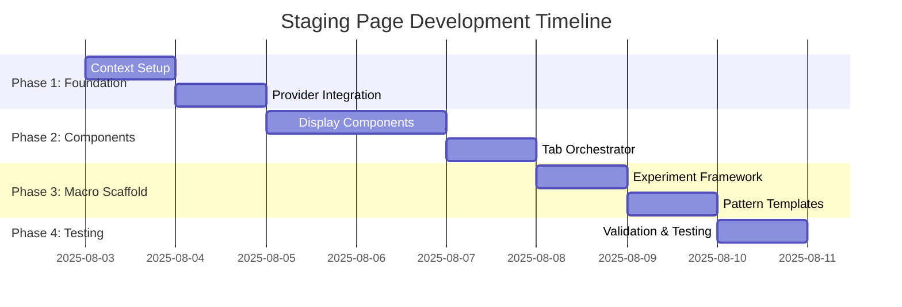

# Product Requirements Document: Nvidia Macro Staging Page

**Version**: 1.0.0  
**Date**: August 2, 2025  
**Project**: Macro Automation Re-Architecture  
**Phase**: 1 - Experimental Staging Infrastructure  

---

## Table of Contents

1. [Executive Summary](#executive-summary)
2. [Project Objectives](#project-objectives)
3. [Technical Requirements](#technical-requirements)
4. [Architecture Design](#architecture-design)
5. [Implementation Phases](#implementation-phases)
6. [Success Metrics](#success-metrics)
7. [Risk Assessment](#risk-assessment)
8. [Resource Requirements](#resource-requirements)
9. [Timeline & Milestones](#timeline--milestones)

---

## Executive Summary

### Project Overview

This PRD defines the development of an experimental "Nvidia (Macro Staging)" page that duplicates the existing NVDA architecture while providing complete isolation for macro automation re-architecture experiments. The staging environment enables safe testing of multiple macro automation approaches without affecting production systems.

### Key Objectives

- **Isolation**: Complete separation from production NVDA/SPY pages
- **Experimentation**: Safe testing environment for macro re-architecture options
- **Comparison**: Apples-to-apples performance comparison with production
- **Risk Mitigation**: Zero impact on stable production functionality
- **Multi-Branch Strategy**: Support for parallel development of different approaches

### Success Criteria

| Metric | Target | Measurement |
|--------|--------|-------------|
| **Isolation Quality** | 100% independence | No shared state with production |
| **Performance Parity** | ±5% of production | Response times and resource usage |
| **Stability** | Zero production impact | No regressions in main tabs |
| **Development Velocity** | 4x faster iteration | Reduced debugging time vs current |

---

## Project Objectives

### Primary Goals

1. **Create Experimental Infrastructure**
   - Duplicate NVDA architecture with complete isolation
   - Provide blank macro template for re-architecture experiments
   - Enable rapid prototyping and testing

2. **Enable Performance Comparison**
   - Identical interface and functionality to production
   - Built-in metrics collection and comparison tools
   - Support for A/B testing between approaches

3. **Support Multi-Branch Development**
   - Foundation for 4 parallel re-architecture experiments
   - Branch isolation strategy for XState, Command Pattern, Server-Side, and Hybrid approaches
   - Consolidated testing and evaluation framework

### Secondary Goals

1. **Risk Mitigation**
   - Complete error isolation from production
   - Safe experimentation without stability concerns
   - Emergency rollback capabilities

2. **Developer Experience**
   - Streamlined development workflow
   - Built-in debugging and monitoring tools
   - Clear documentation and templates

---

## Technical Requirements

### Functional Requirements

#### FR-1: Component Duplication
- **Requirement**: Duplicate all NVDA-specific components for staging
- **Details**: 12 files total (1 context, 1 orchestrator, 10 components)
- **Interface**: Identical APIs and functionality to production
- **Isolation**: Zero shared state or dependencies

#### FR-2: Macro Automation Placeholder
- **Requirement**: Experimental macro component with multiple implementation options
- **Options**: Current pattern, Optimized state, Reactive architecture, Custom experiments
- **Interface**: Configurable experiment selector and implementation switcher
- **Metrics**: Built-in performance monitoring and comparison

#### FR-3: Context Isolation
- **Requirement**: Dedicated React context with 79-field state structure
- **Pattern**: Identical to production with staging-specific hooks
- **Naming**: `useNvdaStagingAnalysis()`, `useNvdaStagingDispatch()`
- **Independence**: Complete separation from production context

#### FR-4: Routing Integration
- **Requirement**: Third tab in main navigation labeled "NVDA (Macro Staging)"
- **Styling**: Orange accent to distinguish from production tabs
- **Accessibility**: Proper ARIA labels and keyboard navigation
- **Responsive**: Mobile-friendly tab layout

### Non-Functional Requirements

#### NFR-1: Performance
- **Response Time**: ±5% of production performance
- **Memory Usage**: No significant increase over production
- **Bundle Size**: <50KB additional overhead
- **Rendering**: No impact on production tab performance

#### NFR-2: Reliability
- **Error Isolation**: Staging errors cannot affect production
- **Fault Tolerance**: Graceful degradation of experimental features
- **Recovery**: Automatic fallback to production patterns

#### NFR-3: Maintainability
- **Code Duplication**: Managed through templates and generators
- **Documentation**: Comprehensive component and API documentation
- **Testing**: Unit tests for all isolated components

---

## Architecture Design

### Component Hierarchy

```
NvdaStagingAnalysisProvider
└── NvdaStagingTabContent (Main Orchestrator)
    ├── NvdaStagingDataSection
    ├── NvdaStagingMacroAutomation (EXPERIMENTAL)
    │   ├── CurrentMacroPattern (Baseline)
    │   ├── OptimizedMacroPattern (State Management)
    │   ├── ReactiveMacroPattern (Reactive Programming)
    │   └── CustomMacroPattern (User Experiments)
    ├── Display Components (7 total)
    │   ├── NvdaStagingStockSnapshotDisplay
    │   ├── NvdaStagingMarketStatusDisplay
    │   ├── NvdaStagingKeyMetricsDisplay
    │   ├── NvdaStagingStandardTaDisplay
    │   ├── NvdaStagingAiAnalyzedTaDisplay
    │   ├── NvdaStagingAiKeyTakeawaysDisplay
    │   └── NvdaStagingAiOptionsAnalysisDisplay
    ├── NvdaStagingOptionsChainTable
    └── NvdaStagingConsolidatedChat
```

### File Structure

```
src/
├── contexts/
│   └── nvda-staging-analysis-context.tsx
├── components/staging/
│   ├── nvda-staging-tab-content.tsx
│   ├── nvda-staging-macro-automation.tsx
│   ├── nvda-staging-*-display.tsx (7 files)
│   ├── nvda-staging-options-chain-table.tsx
│   ├── nvda-staging-consolidated-chat.tsx
│   ├── nvda-staging-data-section.tsx
│   └── staging-error-boundary.tsx
├── actions/
│   └── nvda-staging-consolidated-chat-action.ts
└── lib/staging/
    ├── staging-metrics.ts
    ├── staging-utils.ts
    └── staging-templates.ts
```

### Context Architecture

```typescript
interface NvdaStagingAnalysisState {
  // Identical 79-field structure to production
  status: AppState;
  error: string | null;
  stockSnapshotJson: string;
  marketStatusJson: string;
  // ... all production fields
  
  // Staging-specific additions
  experimentType: 'current' | 'optimized' | 'reactive' | 'custom';
  performanceMetrics: StagingMetrics;
  experimentConfig: Record<string, any>;
}
```

---

## Implementation Phases

### Phase 1: Foundation Setup (Days 1-2)

#### Deliverables
- [ ] Create `/components/staging/` directory structure
- [ ] Implement `nvda-staging-analysis-context.tsx` with 79-field state
- [ ] Set up provider integration in `app/page.tsx`
- [ ] Add routing to `page-content.tsx` with orange accent styling
- [ ] Create `StagingErrorBoundary` component

#### Technical Tasks
1. **Context Creation** (4 hours)
   - Duplicate NVDA context structure
   - Implement staging-specific hooks
   - Add experiment configuration state

2. **Provider Integration** (2 hours)
   - Modify `app/page.tsx` for staging provider
   - Ensure proper provider nesting order
   - Test context isolation

3. **Routing Setup** (2 hours)
   - Add third tab to navigation
   - Implement orange accent styling
   - Test responsive behavior

4. **Error Boundaries** (1 hour)
   - Create staging-specific error boundary
   - Implement production isolation safeguards
   - Add error logging for debugging

### Phase 2: Component Duplication (Days 2-4)

#### Deliverables
- [ ] Duplicate all 10 display components for staging
- [ ] Implement staging tab content orchestrator
- [ ] Create staging chat action and integration
- [ ] Implement staging data section with export functionality

#### Technical Tasks
1. **Display Components** (8 hours)
   - Duplicate 7 core display components
   - Update context imports and hooks
   - Preserve identical functionality

2. **Tab Orchestrator** (6 hours)
   - Create staging tab content component
   - Implement identical handler patterns
   - Integrate macro automation placeholder

3. **Chat Integration** (4 hours)
   - Duplicate consolidated chat action
   - Update schemas for staging
   - Test AI integration functionality

4. **Data Export** (2 hours)
   - Implement staging data section
   - Ensure export functionality works
   - Test JSON export features

### Phase 3: Macro Automation Scaffold (Days 4-5)

#### Deliverables
- [ ] Create experimental macro automation component
- [ ] Implement experiment selector interface
- [ ] Add baseline current pattern implementation
- [ ] Create placeholder templates for other patterns

#### Technical Tasks
1. **Experiment Framework** (4 hours)
   - Design macro experiment selector
   - Implement pattern switching logic
   - Create performance metrics collection

2. **Current Pattern Baseline** (3 hours)
   - Copy production macro logic exactly
   - Ensure identical behavior for comparison
   - Add performance monitoring hooks

3. **Pattern Placeholders** (2 hours)
   - Create template components for each approach
   - Implement basic structure and interfaces
   - Add experiment configuration options

4. **Metrics Integration** (2 hours)
   - Implement performance tracking
   - Create comparison dashboard components
   - Add metrics export functionality

### Phase 4: Testing & Validation (Day 5)

#### Deliverables
- [ ] Complete functional testing of staging environment
- [ ] Performance comparison with production
- [ ] Documentation and deployment preparation
- [ ] Multi-branch strategy preparation

#### Technical Tasks
1. **Functional Testing** (3 hours)
   - Test all staging components
   - Verify isolation from production
   - Validate error boundary behavior

2. **Performance Testing** (2 hours)
   - Compare staging vs production metrics
   - Validate performance parity
   - Test resource usage impact

3. **Documentation** (2 hours)
   - Complete component documentation
   - Create usage guides for experiments
   - Document branch strategy

4. **Branch Preparation** (1 hour)
   - Prepare staging branch for forking
   - Document branch naming conventions
   - Create branch setup instructions

---

## Success Metrics

### Primary Metrics

| Metric | Current | Target | Measurement Method |
|--------|---------|--------|--------------------|
| **Development Velocity** | 20+ debugging iterations | <5 iterations | Time to working prototype |
| **Performance Parity** | Production baseline | ±5% variance | Response time comparison |
| **Isolation Quality** | N/A | 100% independence | State coupling analysis |
| **Error Safety** | N/A | Zero production impact | Error propagation testing |

### Secondary Metrics

| Metric | Target | Measurement Method |
|--------|--------|--------------------|
| **Bundle Size Impact** | <50KB overhead | Webpack bundle analysis |
| **Memory Usage** | No significant increase | Browser dev tools monitoring |
| **Developer Experience** | 4x faster iteration | Time to implement experiment |
| **Test Coverage** | >90% for staging components | Jest coverage reports |

### Key Performance Indicators (KPIs)

1. **Experiment Success Rate**: Percentage of experiments that complete without errors
2. **Performance Comparison Accuracy**: Ability to detect performance differences
3. **Branch Development Efficiency**: Time to implement each re-architecture option
4. **Production Stability**: Zero regressions in main NVDA/SPY functionality

---

## Risk Assessment

### High Risk Items

| Risk | Impact | Probability | Mitigation Strategy |
|------|--------|-------------|-------------------|
| **Context Coupling** | High | Medium | Strict naming conventions, automated testing |
| **Performance Degradation** | High | Low | Continuous monitoring, bundle analysis |
| **Production Impact** | Critical | Very Low | Error boundaries, complete isolation |

### Medium Risk Items

| Risk | Impact | Probability | Mitigation Strategy |
|------|--------|-------------|-------------------|
| **Code Duplication Maintenance** | Medium | Medium | Template generators, automated updates |
| **Memory Leaks** | Medium | Low | Proper cleanup, memory monitoring |
| **Browser Compatibility** | Medium | Low | Cross-browser testing, progressive enhancement |

### Low Risk Items

| Risk | Impact | Probability | Mitigation Strategy |
|------|--------|-------------|-------------------|
| **Styling Conflicts** | Low | Low | Scoped CSS, component isolation |
| **Accessibility Issues** | Low | Low | ARIA testing, keyboard navigation validation |
| **Documentation Drift** | Low | Medium | Automated documentation generation |

### Risk Mitigation Strategies

1. **Automated Testing**
   - Unit tests for all staging components
   - Integration tests for context isolation
   - Performance regression testing

2. **Monitoring & Alerts**
   - Real-time performance monitoring
   - Error tracking and alerting
   - Memory usage monitoring

3. **Rollback Procedures**
   - Quick disable mechanism for staging tab
   - Fallback to production patterns
   - Emergency isolation procedures

---

## Resource Requirements

### Development Team

| Role | Allocation | Duration | Responsibilities |
|------|------------|----------|------------------|
| **React Developer** | 100% | 5 days | Component duplication, context setup |
| **Architecture Lead** | 50% | 5 days | Design oversight, code review |
| **QA Engineer** | 25% | 2 days | Testing, validation, documentation |

### Infrastructure Requirements

| Resource | Specification | Purpose |
|----------|---------------|---------|
| **Development Environment** | Local development setup | Component development and testing |
| **Bundle Analysis Tools** | Webpack Bundle Analyzer | Monitor bundle size impact |
| **Performance Monitoring** | Browser DevTools, React DevTools | Performance comparison and optimization |
| **Version Control** | Git with multi-branch strategy | Support parallel development |

### Dependencies

| Dependency | Version | Purpose | Risk Level |
|------------|---------|---------|------------|
| **React** | 18.3.1 | Component framework | Low |
| **Next.js** | 15.3.3 | App router and SSR | Low |
| **TypeScript** | 5.x | Type safety | Low |
| **Existing NVDA Components** | Current | Duplication source | Medium |

---

## Timeline & Milestones

### Development Schedule



### Key Milestones

| Milestone | Date | Deliverable | Success Criteria |
|-----------|------|-------------|------------------|
| **M1: Foundation Complete** | Day 2 | Context and routing setup | Staging tab renders without errors |
| **M2: Components Complete** | Day 4 | All components duplicated | Full feature parity with production |
| **M3: Scaffold Complete** | Day 5 | Macro experiment framework | Experiment switching works |
| **M4: Validation Complete** | Day 5 | Testing and documentation | Ready for branch creation |

### Critical Path Dependencies

1. **Context Setup** → **Component Duplication** → **Macro Scaffold** → **Testing**
2. **Provider Integration** must complete before component integration
3. **Error Boundaries** must be implemented before macro experiments
4. **Performance Monitoring** must be ready before comparison testing

---

## Quality Assurance

### Testing Strategy

#### Unit Testing
- [ ] Context hook behavior
- [ ] Component rendering
- [ ] Error boundary functionality
- [ ] Performance metrics collection

#### Integration Testing
- [ ] Context isolation verification
- [ ] Component interaction testing
- [ ] Routing and navigation
- [ ] Experiment switching logic

#### Performance Testing
- [ ] Bundle size analysis
- [ ] Memory usage monitoring
- [ ] Response time comparison
- [ ] Resource utilization tracking

### Code Review Requirements

1. **Architecture Review**: All architectural decisions reviewed by tech lead
2. **Security Review**: Error isolation and context separation validation
3. **Performance Review**: Bundle size and performance impact assessment
4. **Documentation Review**: Completeness and accuracy of documentation

---

## Deployment Strategy

### Environment Setup

1. **Development**: Local environment with staging tab enabled
2. **Testing**: Complete functional and performance testing
3. **Branch Preparation**: Ready for multi-branch experimentation
4. **Production**: Staging tab available for experimentation

### Rollout Plan

#### Phase 1: Internal Development
- Deploy staging tab to development environment
- Internal team testing and validation
- Performance comparison with production

#### Phase 2: Controlled Testing
- Enable staging tab for limited testing
- Monitor performance and stability
- Gather feedback on experiment framework

#### Phase 3: Branch Creation
- Create 4 experiment branches from staging foundation
- Begin parallel development of re-architecture options
- Continuous integration and testing

### Success Validation

1. **Functional Validation**: All staging components work identically to production
2. **Performance Validation**: Performance parity confirmed through testing
3. **Isolation Validation**: Zero impact on production functionality verified
4. **Experiment Validation**: Experiment framework ready for re-architecture options

---

## Appendices

### Appendix A: Component Mapping

| Production Component | Staging Component | Lines of Code | Complexity |
|---------------------|-------------------|---------------|------------|
| `nvda-analysis-context.tsx` | `nvda-staging-analysis-context.tsx` | 370 | High |
| `nvda-tab-content.tsx` | `nvda-staging-tab-content.tsx` | 770 | High |
| `simple-analyze-all-button.tsx` | `nvda-staging-macro-automation.tsx` | 1,400+ | Very High |
| Display components (7) | Staging display components (7) | ~1,200 | Low-Medium |
| **Total** | **Staging Implementation** | **~3,740** | **Mixed** |

### Appendix B: Performance Baselines

| Metric | Production NVDA | Target Staging | Measurement |
|--------|-----------------|---------------|-------------|
| Initial Load Time | 2.1s | <2.2s | Time to first paint |
| Context State Size | 79 fields | 79 fields + experiments | Memory usage |
| Bundle Size | 247KB | <297KB | Webpack analysis |
| Macro Execution | 15-30s | ±5% variance | End-to-end timing |

### Appendix C: Experiment Templates

```typescript
// Template for new macro experiments
interface MacroExperiment {
  id: string;
  name: string;
  description: string;
  implementation: () => JSX.Element;
  metrics: ExperimentMetrics;
}

// Standard experiment interface
interface ExperimentMetrics {
  executionTime: number;
  stateUpdates: number;
  rerenders: number;
  memoryUsage: number;
  errorRate: number;
}
```

---

**Document Status**: Draft  
**Next Review**: After Phase 1 completion  
**Approval Required**: Architecture Team, Product Owner
